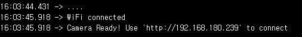
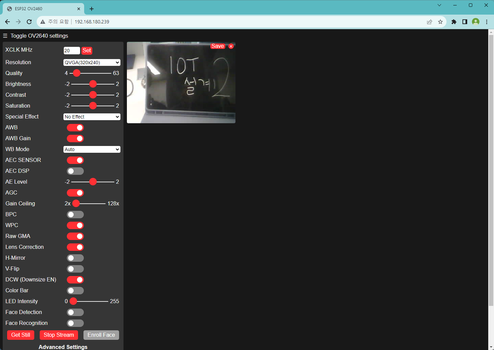

# IOT 시스템 설계과제 2

## 1. 카메라 설정

- 카메라 와이파이 설정

` \DESIGN\CameraWebServer\CameraWebServer.ino` 코드 안에, 38~39번 라인에 사용하려고 하는 와이파이의 ssid와 패스워드를 입력.

```c++
// ===========================
// Enter your WiFi credentials
// ===========================
const char* ssid = "****";
const char* password = "****";
```

- 카메라 실시간 스트리밍 확인

아두이노로 ``\DESIGN\CameraWebServer\CameraWebServer.ino``코드를 컴파일 및 ESP32-CAM에, Ai Thinker ESP32-AM 보드를 통해 업로드 한 뒤, 115200 baud로 보내지는 메시지를 시리얼 모니터를 통해 확인한다.



이후, 웹 브라우저를 통해 해당 웹 페이지를 방문 하여, ESP32-CAM을 통해 스트리밍 되고 있는 것을 확인할 수 있다.


