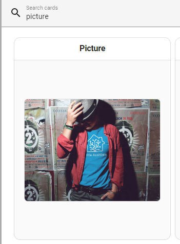

# IOT 시스템 설계과제 2

## 1. 카메라 설정

- 카메라 와이파이 설정

` \DESIGN\CameraWebServer\CameraWebServer.ino` 코드 안에, 38~39번 라인에 사용하려고 하는 와이파이의 ssid와 패스워드를 입력.

```c++
// ===========================
// Enter your WiFi credentials
// ===========================
const char* ssid = "****";
const char* password = "****";
```

- 카메라 실시간 스트리밍 확인

아두이노로 ``\DESIGN\CameraWebServer\CameraWebServer.ino``코드를 컴파일 및 ESP32-CAM에, Ai Thinker ESP32-AM 보드를 통해 업로드 한 뒤, 115200 baud로 보내지는 메시지를 시리얼 모니터를 통해 확인한다.


이후, 웹 브라우저를 통해 해당 웹 페이지를 방문 하여, ESP32-CAM을 통해 스트리밍 되고 있는 것을 확인할 수 있다.


## 2. NodeMCU 설정

## 3. HASS 설정

  HASS 웹서버를 RPI4에서 가동시킨 뒤, 카메라 스트리밍과 NodeMCU로부터 받는 온습도 데이터를 확인할 수 있도록 설정한다.

- 카메라 스트리밍

  HASS의 lovelace UI를 통해, 카메라 스트리밍을 확인할 수 있도록 설정한다.


\+ ADD CARD 버튼을 누른 뒤, picure 를 검색하여 추가한다.


이루, Edit를 눌러 picture card의 설정을 변경한다. 이때, 카메라 스트리밍을 위한 url을 입력한다. 이 url은 ESP32-CAM의 IP 주소와 포트 번호를 통해 접근할 수 있다. IP 수소는 이전 단계에서 확인힌 IP 수소를 입력하면 되고, 포트 번호는 80번 포트를 사용한다.

이후, 카메라 스트리밍을 확인할 수 있다.